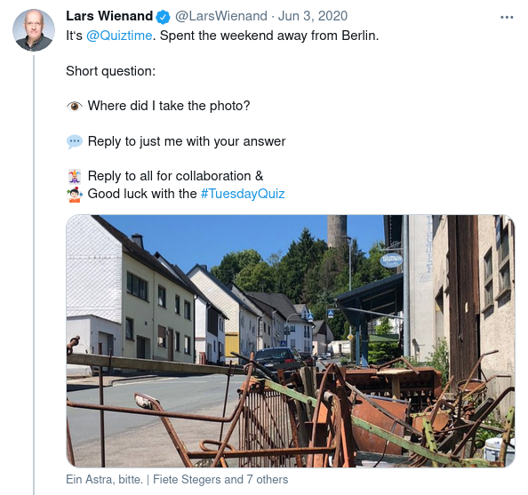
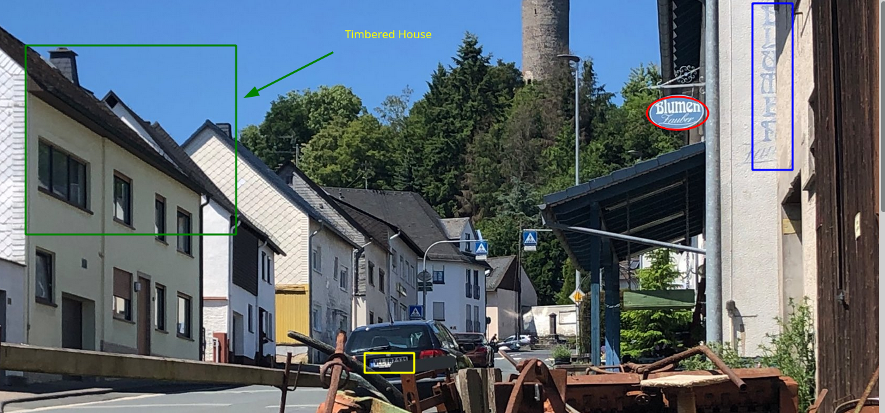
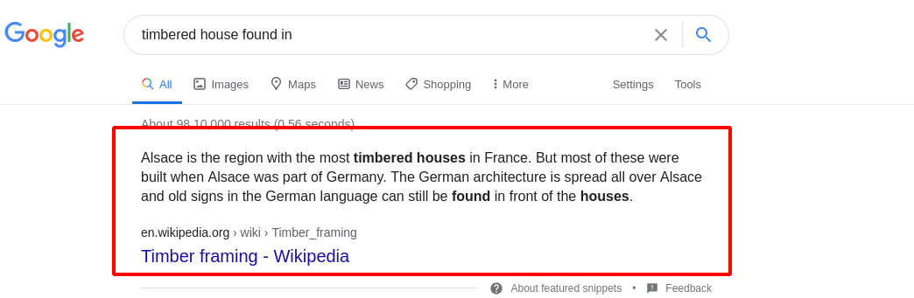
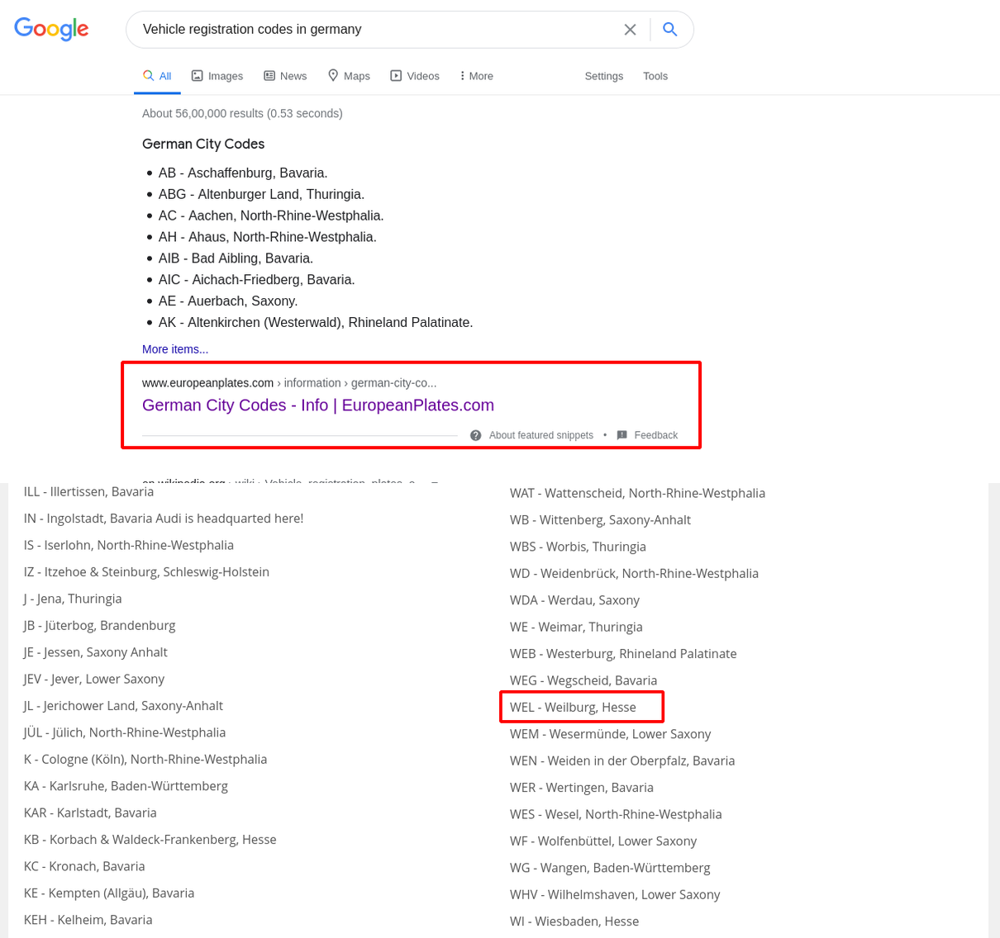
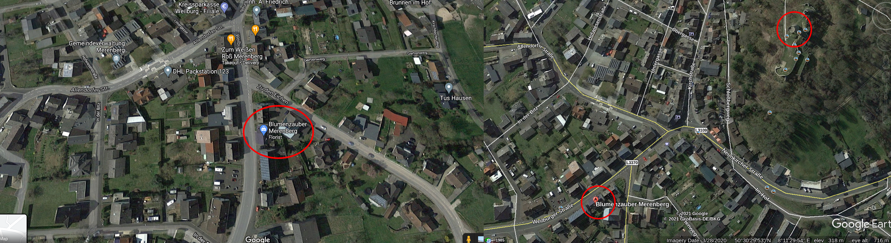
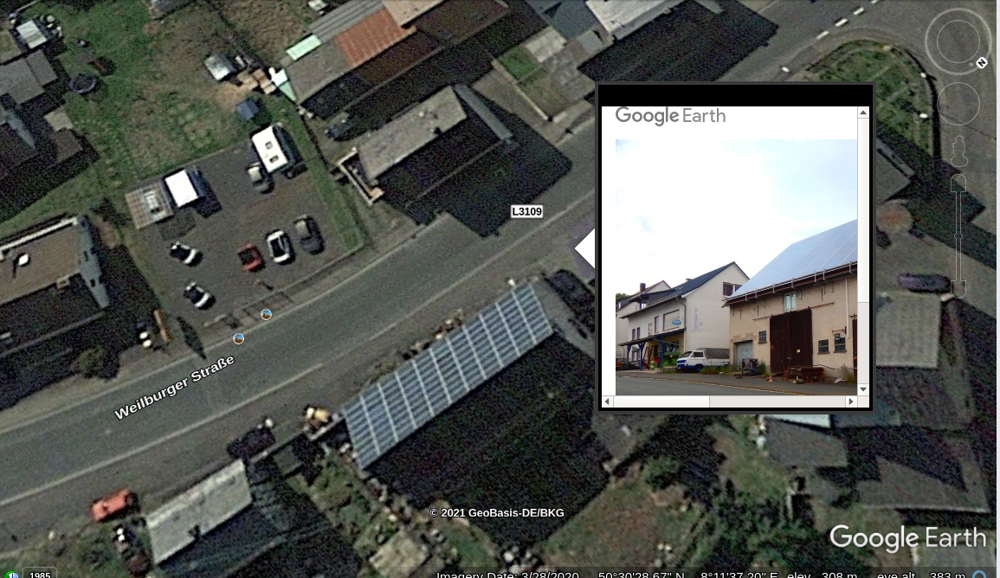

# 03 June 2020

> :bookmark: Written by twitter at iamsarvagyaa

Hey, here is another quiztime's challenge solution. On 03 June 2020, LarsWienand posted a challenge which was easy to geolocate - [Challenge](https://twitter.com/LarsWienand/status/1267904226870640640). Question of this challenge : **Where did I take the photo?**

First of all I downloaded this image and started exploring clues in this image. I got lot of important clues in this image:

- Timber framing houses, probably found in Germany
- Blumen Zauber Shop/Restaurent
- Number Plate of Car started with **"WEL"**

I searched on Google **"timbered house found in"** and I got this ...

Architectural structure of houses looks like Germany, So I Searched **Vehicle registration codes in Germany**. I found an article which reveals the city of Germany, respected to **WEL** vehicle registration code.

- Website - https://www.europeanplates.com/information/german-city-codes.html

Now, I searched **"BlumenZauber in Weilburg, Germany"** on Google and I found flower shop named BlumenZauber. I checked some of it's images and I found similar scenario after that I look for backround "tall turm" in weilburg and I found near BluemenZauber. Below is geolocated shop and turm.

Challenge is completed, finally geolocated. Look at this google-earth view, looks like similar scenario and also google-photos confirm that this is BluemenZauber shop and street Weilburger. 

Solved, Thank You :)

- Coordinates : 50.5079641,8.1935197

- Location : Blumenzauber Merenberg, Weilburger Straße, Merenberg, Germany