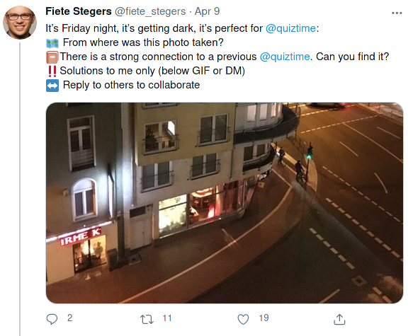
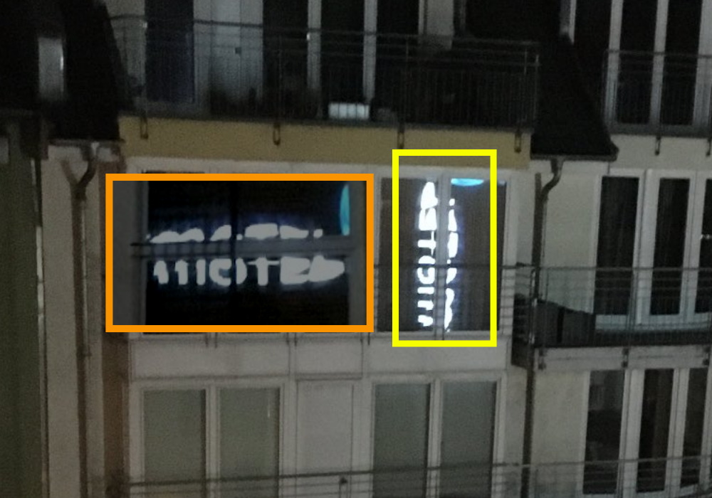
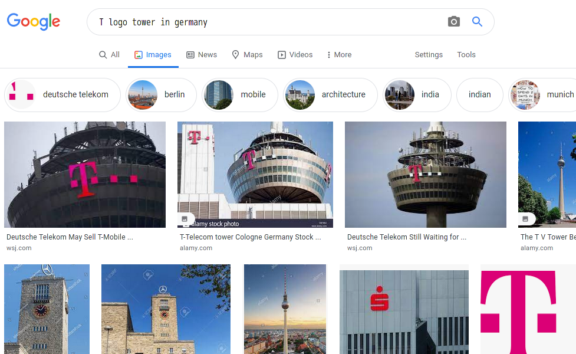

# 09 April 2021

>   :bookmark: Written by twitter at iamsarvagyaa

Hello to all of you :hand: I just recovered from COVID and today I was eager to learn new stuff, So I started solving quiztime challenges. Here, is a good challenge which is lil bit tough for me. Challenge was posted by Fiete Stegers. Here is challenge - [look at this](https://twitter.com/fiete_stegers/status/1380585885419327490).

I started looking for clues in this image, got lot of clues but the problem is I'm from India not from Europe side, that's why I got lot of problems but here I'll show you how I faced and solved this challenge. Problems like, I don't know much about structure, landmarks etc of Germany. First of all I downloaded the image and started finding clues in this image. I got no strong clue and I don't know what to do. Below are clue marks.

Now, I croped the name "Motel", flipped and rotate it. Also, I imported that flipped image and glued on question image. I found the name "Motel" and that is easy to read after flipping the text. Searched on google  **Motel One in Germany**, got lots of hotels and this will take time. So, I quit this process and start working on next clue which is a tower and the logo **"t"** clearly visible.

> :bulb: **Note** Why I searched for Germany? - because fiete is from germany, I saw a lot of tweets of him which is in german language. That's why I searched.

I searched in Google, **"t logo tower in germany"** and I got wonderful result. Got the name of that tower. Here, is an article - https://www.wsj.com/articles/deutsche-telekom-may-sell-t-mobile-netherlands-unit-1445358195. The name of the tower is **deutsche telekom** .

Opened google map and searched this "deutsche telekom near Colonial Broadcasting Tower, Inner Kanalstraße, Cologne, Germany" and got this result. One of the best thing, I got water sources near telekum tower which is near mediapark. Now, I feel like the challenge is solved. Look at the highlighted areas.

Because, there's a hotel named "Hotel Motel One Köln-Mediapark". I jumped into street view and I started matching all clues. Air ventilation is also matching and water source is also matching, there's a traffic light is also matching. Finally, we solved this challenge :) 

I learned a lot of things. Learned, donot leave any clues.

-   Co-ordinates : 50.9471436,6.9451573
-   Answer : Hotel Motel One Köln-Mediapark, Cologne, Germany.