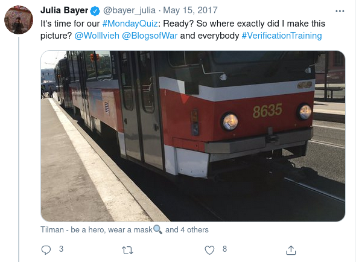
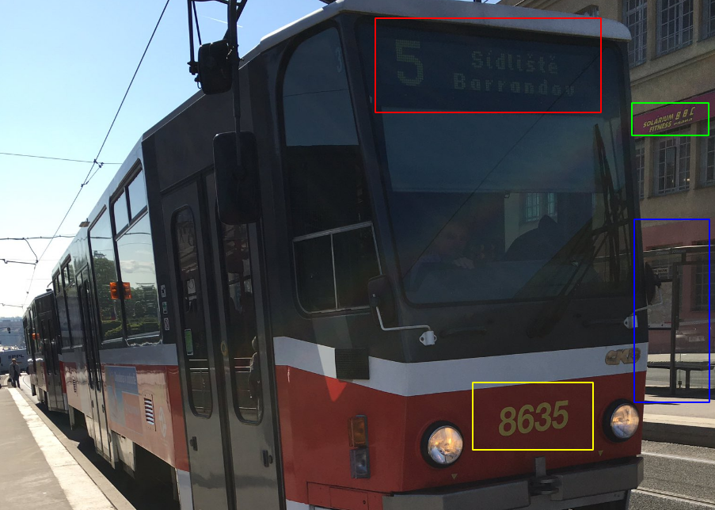
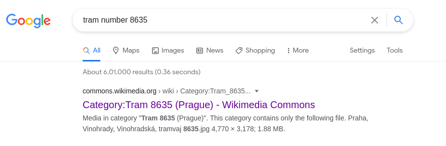
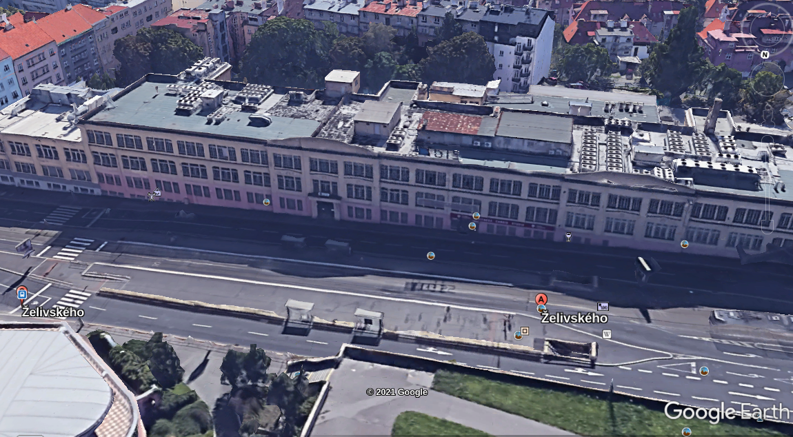
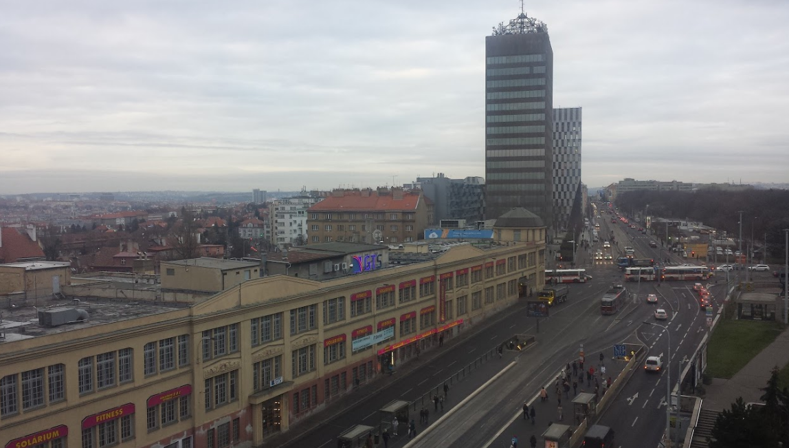
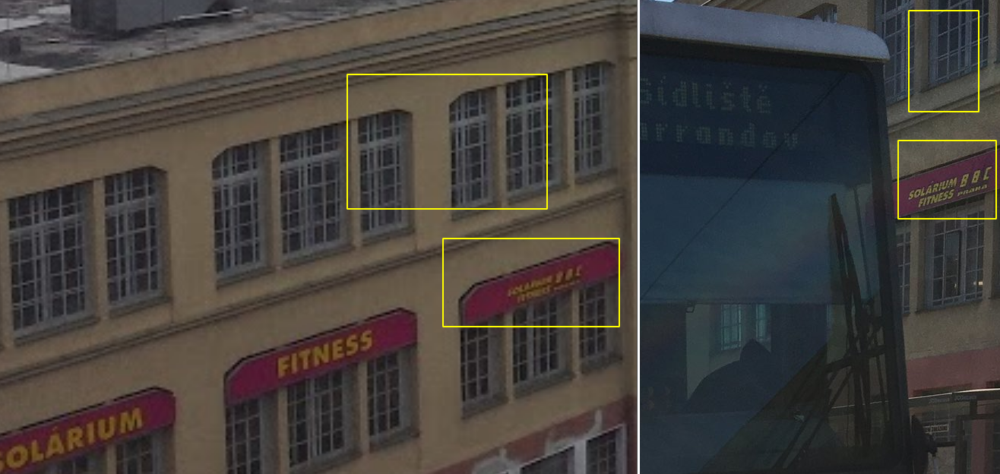

# 15 May 2017

> :bookmark: Written by twitter at iamsarvagyaa

Hello to all of you. Today I solved another quiztime challenge which is nice and tricky to pinpoint the location. Challenge was posted by Julia Bayer, here you go. [Challenge - 15 May 2017](https://twitter.com/bayer_julia/status/864023752664862720) . Question is **"Where exactly did I make this pic?"**.

As you all know, we should start from clues. So, first of all I downloaded the image and started finding clues. Got 3-4 clues, below are list ...

- Tram Number : 8635
- route 5, Sidliste Barrandov stopage
- Solarium BBC Fitness Praha Club
- Stopage stand for passengers marked with blue, 

I started searching clues on Google and I got Prague from **Tram Number-8635**.

An article reveals the Prague, So I started searching the next clue in google and we got Sidliste Barrandov stopage which is in Parague and also I found the tram's route 5 - [look at this](https://transit.navitime.com/en/cz/line/00000005). Now, it's time to search the fitness club, and we got a good result but the challenge is too old from 2017. Google shows some articles where exact location is given :

- https://www.expats.cz/en/prague/czech/fitness-centers-and-gyms/solarimbbcfitness-1-1-1
- https://www.slevomat.cz/podnik/6853-solarium-fitness-bbc : Reviews are old

Reviews are too old but we got the location of this solarium and fitness club. So, I opened Google Map and searched the location **"Vinohradská 1630/190, Praha, Zalivskeho"** but we got another fitness club on this location. So, I decided to look in Google Earth and Google images. I got the result ...

According to present date, we got another fitness club named "Form factory fitness club" on this location. So I look old images in google earth and I got similar image with "Solarium BBC Fitness". Below ...

Now, I started matching clues with this image and I got the signboard of **"Solarium BBC"** and also structure of windows are same as challenge image.  Finally we solved the challenge. I hope you learned something new from this.

- Image : https://lh5.googleusercontent.com/p/AF1QipOkot759ypVcmzUCtm8tADBTZh1nplx3isuwgmH=h720
- Co-ordinates : 50.0782294,14.4738157
- Location : Vinohradská 1630/190, Praha, Zalivskeho

