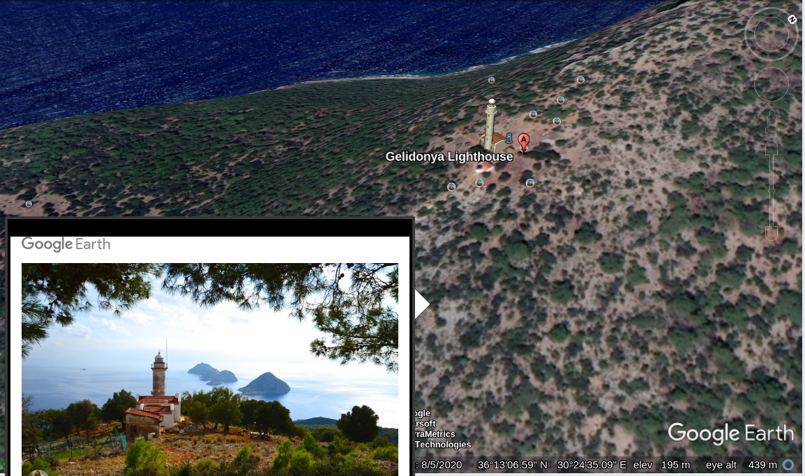

# 25 February 2021

> :bookmark: Written by twitter at iamsarvagyaa

Hey, quiztime family :heart: This is my first solution-post and I'm a newbie in verification. Pardon me, if there's any mistake. On 25 February 2021 Twone2 posted a challenge - [look at this](https://twitter.com/twone2/status/1364668148868341765), which was a pretty easy and interesting challenge. Here you go :)

I started exploring image and I got lot of clues: 

- A lighthouse, 
- group of island
- a Turkish flag, 
- and an island. 

First of all, I started searching **island with lighthouse in turkey** and Google shows a lot of results but one or two images are similar from question-image. 

- Article reveals the place - https://www.alamy.com/gelidonya-lighthouse-and-islands-on-lycian-way-in-antalya-turkey-image255472232.html

Now, it's time to see the map and start matching all clues in respected Geo-areas. Searched **Gelidonya Lighthouse**, and I got this result in Google earth:

There lot of images found there at Gelidonya Lighthouse. I watched all of them and one of the image is exact to the quiztime-image. Look at both image -

Both have lighthouse, Turkish flag, group of island, and compass. Finally, we solved the quiztime challenge. I hope you understand well. Thank You :)

- Coordinates : 36.2194138,30.4097443
- Answer : Gelidonya Lighthouse, Mavikent, Yeşilköy Köyü, Turkey