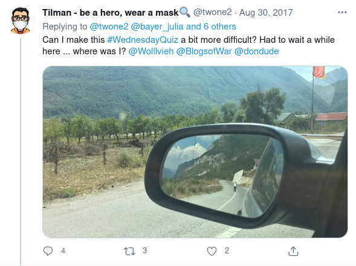
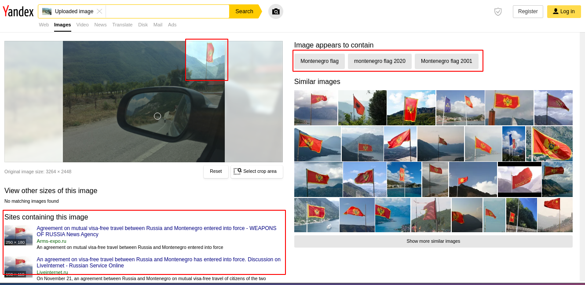
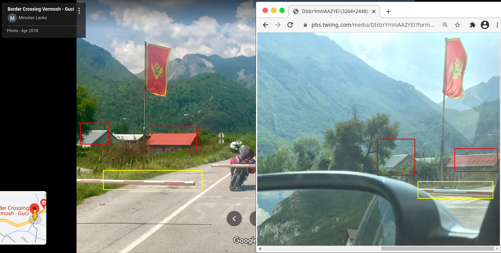

# 30 August 2017

> :bookmark: Written by twitter at iamsarvagyaa

Hola! I was reading bellingcat's article about QuizTime - [read from here](https://www.bellingcat.com/resources/2017/11/13/daily-verification-quizzes/) and I found all the challenges are interesting. So, I started solving challenges from first. Basically challenge posted by Twone2, which is pretty much easy to solve but it's tricky. [Challenge - 30 August 2017](https://twitter.com/twone2/status/902817481894633472).

Question is straight, **Where was I?** So let's start. First of all I downloaded the image and started exploring clues. As we can see the flag and scenario in mirror, looks like a hilly areas and passway. So, I started finding clues and I see the flag and barricading checkpoint behind the mirror of car. I Selected crop area in Yandex and found the montenegro flag. Now, it's time to search geographical areas like terrains, borders etc. According to my twitter search query **from:twone2 since:2017-05-01 until:2017-9-01 albania** it seems, twone2 is from Albania because there lots of tweets are based on albania. I searched on google "Montenegro Border Checkpoints" because of barricading and I found an article - [here](https://www.montenegro.travel/en/info/border-crossings-and-visas) reveals all the borders in montenegro and albania too. Now it's time to open google map to explore the terrains along with border checkpoint in between montenegro and albania. 

Searched on google map "border crossings grnčar" I found a result - **Border Crossing Vermosh - Guci**. I checked almost all images which is available in photos section of google map, and this area maches as challenge image.

Aaaaaaand we solved this challenge, Thank You :)

- Image : https://goo.gl/maps/RrjLvAQcNbD4Us17A
- Co-ordinates : 42.5833746,19.7747952
- Location : Grncar, Border Crossing Vermosh - Guci, Montenegro. 